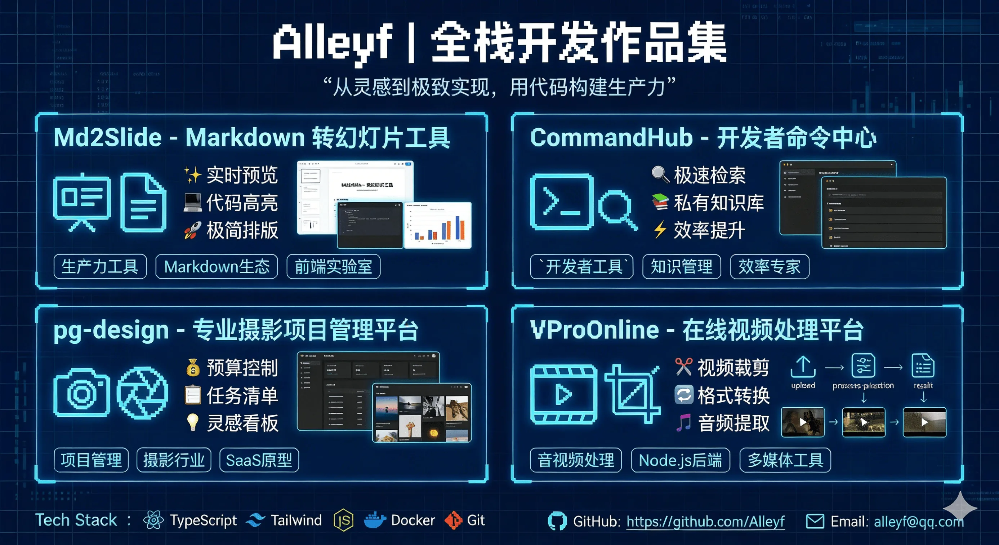
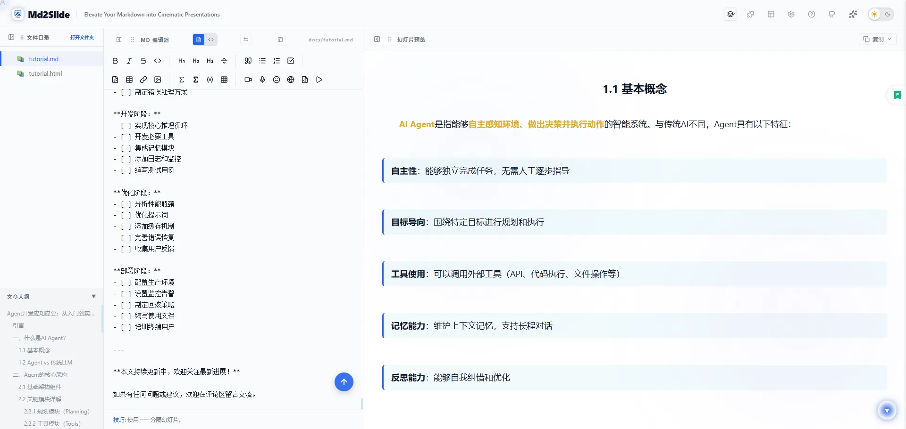
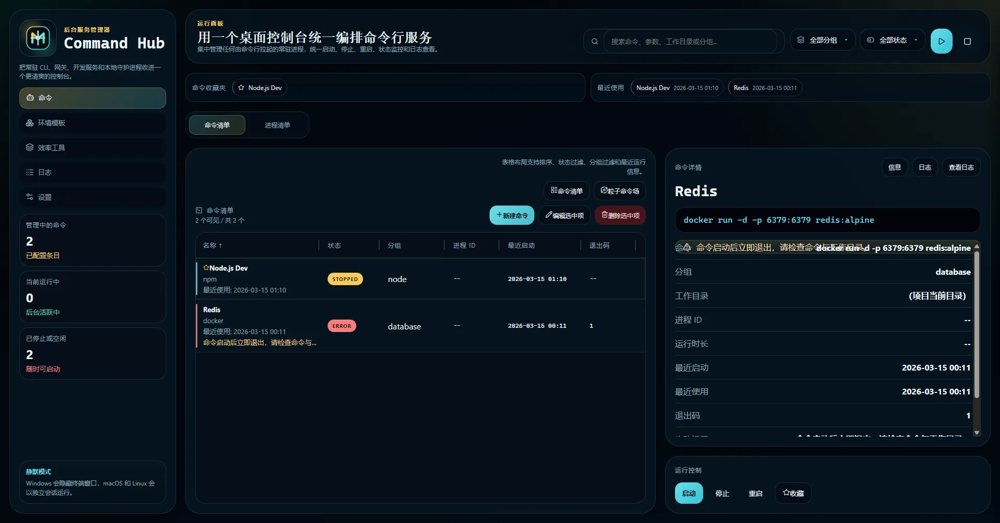

# Flowfolio

<p align="center">
  
</p>

<p align="center">
  一个以分页叙事方式呈现的个人作品化简历网站，聚焦 Java 全栈、微服务、云原生与工程化实践。
</p>

## 项目简介

`Flowfolio` 是一个基于 `React + Vite + MUI + Framer Motion` 构建的交互式个人作品集网站。项目采用分屏式浏览体验，通过整页切换、项目翻转卡片、作品矩阵轮播、海报模态窗等方式，把传统简历转成更具展示感的前端作品。

主要特性：

- 终端开场动画，自动进入简历首页
- 分页式浏览体验，支持滚轮、方向键与触控切换
- 教育背景时间线展示
- 项目经历翻转卡片，区分项目介绍、角色与职责亮点
- 作品矩阵轮播浏览
- 作品集总览海报模态窗
- 数字身份证与联系信息模块

## 海报总览



## 页面预览

#### Md2Slide



#### CommandHub



#### PG Design


#### VProOnline


## 技术栈

- React 19
- Vite
- Material UI
- Framer Motion
- ECharts
- Three.js
- Lucide React

## 项目结构

```text
.
├── public/
│   └── art/
│       ├── street/
│       │   ├── 001.webp
│       │   └── 002.webp
│       └── portrait/
│           └── cover.jpg
│   └── resume/
│       ├── logo.webp
│       ├── poster.webp
│       ├── avatar.webp
│       ├── Md2Slide.webp
│       ├── CommandHub.webp
│       ├── PG Design.webp
│       ├── VProOnline.webp
│       └── resume.pdf
├── src/
│   ├── App.jsx
│   ├── main.jsx
│   ├── styles.css
│   └── config/
│       └── siteConfig.js
├── index.html
├── package.json
└── vite.config.js
```

## 本地开发

安装依赖：

```bash
npm install
```

启动开发环境：

```bash
npm run dev
```

构建生产版本：

```bash
npm run build
```

预览生产构建：

```bash
npm run preview
```

## 静态资源说明

项目中的主要展示素材位于 `public/resume/`：

- `logo.webp`: 站点 logo
- `poster.webp`: 作品集总览海报
- `avatar.webp`: 数字身份证头像
- `Md2Slide.webp`
- `CommandHub.webp`
- `PG Design.webp`
- `VProOnline.webp`
- `resume.pdf`: 简历附件

艺术矩阵素材目录位于 `public/art/`：

- 每个子文件夹代表一个摄影分类（文件夹名即分类名）
- 支持格式：`png/jpg/jpeg/webp/gif/avif`
- 示例：`public/art/street/001.webp`、`public/art/portrait/cover.jpg`
- 前端会自动按分类聚合并在“作品矩阵”页切换到“艺术矩阵”时展示

如果需要替换展示资源，优先修改 `src/config/siteConfig.js` 中对应路径。

## 部署

项目支持一键部署到主流静态托管平台：

### Vercel 一键部署

点击下方按钮，即可将本项目一键部署到 Vercel：

[](https://vercel.com/new/clone?repository-url=https%3A%2F%2Fgithub.com%2F[Alleyf]%2F[Flowfolio])


### GitHub Pages 部署

项目已配置 GitHub Actions 自动部署。

#### 1. 自动部署（推荐）

1. 在 GitHub 仓库设置中，进入 `Settings > Pages`。
2. 在 `Build and deployment > Source` 中选择 `GitHub Actions`。
3. 之后每次推送（Push）代码到 `main` 或 `master` 分支，都会触发自动构建并部署。

#### 2. 手动部署

如果您更喜欢手动操作，可以使用以下命令：

```bash
npm run deploy
```

构建产物默认输出到 `dist/`，并由 `gh-pages` 自动推送到 `gh-pages` 分支。

